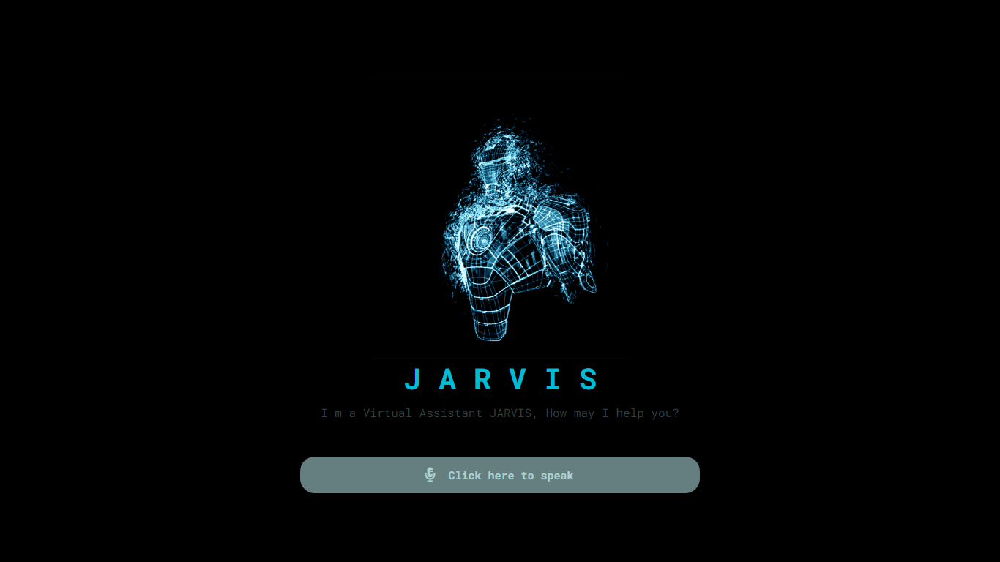

# JARVIS Voice Assistant 🚀

JARVIS is a voice-activated assistant built entirely with JavaScript, HTML, and CSS. It can perform a variety of tasks such as web searching, opening and operating system apps, and more. Experience the ease of hands-free operation directly from your web browser.

## Features ✨

- **Voice Commands**: Interact with JARVIS using natural language.
- **Web Searching**: Perform web searches quickly and efficiently.
- **App Control**: Open and manage applications on your operating system (requires proper setup).
- **Extensible**: Easy to extend with new commands and functionalities.

## Demo 🌐

Check out the live demo: [JARVIS Voice Assistant](https://pkprajapati7402.github.io/JARVIS-voice-assistant/)

## Screenshot 📸



## Installation 🛠️

To run JARVIS locally, follow these steps:

1. Clone the repository:
   ```bash
   git clone https://github.com/pkprajapati7402/JARVIS-voice-assistant.git
   ```

2. Navigate to the project directory:
   ```bash
   cd JARVIS-voice-assistant
   ```

3. Open the `index.html` file in your preferred web browser.

## Usage 🎤

1. Open the application in your web browser.
2. Click the microphone button to activate voice listening.
3. Speak your commands clearly.
4. JARVIS will respond and perform the desired tasks.

## Commands 🗣️

Here are some example commands you can use with JARVIS:

- **Web Search**: "Search for [query]"
- **Open Application**: "Open [application name]"
- **Other Commands**: Customize and add more commands as per your requirement.

## Contributing 🤝

Contributions are welcome! Please follow these steps:

1. Fork the repository.
2. Create a new branch:
   ```bash
   git checkout -b feature/your-feature-name
   ```
3. Make your changes.
4. Commit your changes:
   ```bash
   git commit -m "Add your commit message"
   ```
5. Push to the branch:
   ```bash
   git push origin feature/your-feature-name
   ```
6. Open a pull request.

## License 📄

This project is licensed under the MIT License. See the [LICENSE](LICENSE) file for details.

## Contact 📧

For any questions or feedback, please open an issue in the repository or contact the maintainer:

- **GitHub**: [pkprajapati7402](https://github.com/pkprajapati7402)

---

Thank you for using JARVIS Voice Assistant! We hope it makes your life easier and more productive. 🎉
